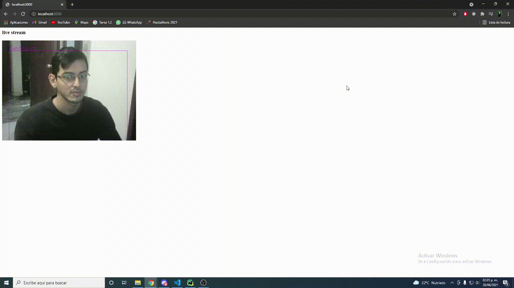

# YoloV4 web
This is a small implementation for YoloV4 for object detection on the browser 
using your webcam

# Download the repository
```
$ git clone https://github.com/mikecaav/Web-YOLOv4.git
$ cd Web-YOLOv4
```

## Create a virtual environment
 ```
 $ pip install virtualenv
 $ virtualenv venv
 ```

## Installation
Install the requirements needed to run the project
```
$ pip install -r requirements.txt
```

### Install pytorch
#### CPU only
```
pip install torch==1.4.0+cpu torchvision==0.5.0+cpu -f https://download.pytorch.org/whl/torch_stable.html
```


#### GPU
For this installation make sure that you have the corresponding version for
cuda 10.1. You can check all the available versions and the installation details 
<a href="https://developer.nvidia.com/cuda-10.1-download-archive-base">here</a>.
```
pip3 install torch==1.4.0 torchvision==0.5.0 -f https://download.pytorch.org/whl/cu101/torch_stable.html
```

## Run the project
To execute the project you just need to run the app.py file.
This will run on the local host on 5000 port.
```
$ python app.py
```

## Results


